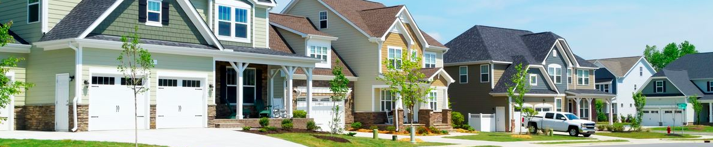

## Комбинирование регрессионнного анализа и машинного обучения для более точных прогнозов и высокой интерпретируемости модели

_Регрессионный анализ, машинное обучение, описательная аналитика, предиктивная аналитика,_

  

#### Содержание 

1. [Обзор проекта и краткие результаты](#review)
2. [Описание датасета](#dataset_description)
3. [Работа с отсутствующими значениями](#missed_values)
4. [ML-модель №1 (базовая)](#model_base)
5. [Исследование данных](#eda)  
6. [Очистка данных](#clear)  
   6.1. [Выявление и удаление выбросов](#outliers)  
   6.2. [Проверка данных на несоответствие](#discrepancy)  
7. [ML-модель №2 (после очистки данных)](#model_inter1)
8. [Создание дополнительных предикторов](#feature_engineering)  
   8.1. [Предикторы, характеризующие площадь](#square_feet)  
   8.2. [Предикторы, характеризующие помещения (жилые комнаты, ванные комнаты, кухни)](#rooms)  
   8.3. [Предикторы, характеризующие даты](#dates)  
9. [Предварительная подготовка данных](#preprocessing)
10. [ML-модель №3 (после создания новых признаков)](#model_inter2)
11. [Линейные модели и регрессионный анализ](#model_linear)  
    11.1. [Эластичная сеть](#elastic_net)  
    11.2. [Линейная регрессия](#linear_regression)  
    11.3. [Результаты линейных моделей на сэмплированных данных](#simulations)  
12. [Выбор ML-модели для прогнозирования остатков линейной регрессии](#residuals)  
    12.1. [Опорные вектора, бустинги, бэггинг, случайный лес, K-ближайших соседей](#ml_simple)  
    12.2. [Добавление оценщиков верхнего уровня - Voting и Stacking](#vote_stack)  
    12.3. [Сравнение всех моделeй и выбор финального оценщика остатков регрессии](#residuals_final)  
    12.4. [Комбинирование линейной регрессии и ML-алгоритма - итоговый оценщик HousePricePredictor](#hpp)  
13. [Оценка независимых ML-моделей](#ml_models)
15. [Подведение итогов](#final_results)  
    14.1. [Сравнение всех моделей](#all_models)  
    14.2. [Актуальные и спрогнозированные цены](#predicted_actual)  
    14.3. [Анализ остатков HPP](#hpp_residuals)  
    14.4. [Дальнейшие шаги](#further)

### 1. Обзор проекта и краткие результаты 

#### Постановка задачи

Современные алгоритмы машинного обучения обычно превосходят классические линейные методы в точности прогнозов, но при этом сложны в интерпретации. Некоторые алгоритмы имеют встроенный функционал приоритезации предикторов, что позволяет выявить наиболее информативные. Тем не менее, этого недостаточно для оценки взаимосвязей. 

Целью данного проекта является создание простой в интерпретации модели HousePricePredictor, которая по точности прогнозов не уступает лучшим алгоритмами машинного обучения. Модель состоит из двух уровней: на первом уровне используется линейная регрессия для выдачи первичных прогнозов и определения коэффициентов для интерпретации; второй уровень - это алгоритм машинного обучения, прогнозирующий величину остатков (ошибок) регрессии для увеличения тчоности прогнозов. Эта схема во многом напоминает первую итерацию бустинга, в котором каждая последующая итерация минимизирует ошибку предыдущей. 

#### Этапы проекта

___Секция 1: Исследование и подготовка данных___

На первом этапе проводятся необохдимые процедуры анализа и подготовки данных: заполняются пропущенные значения, выявляются и исправляются противоречия в данных, определяются наиболее значимые предикторы, создаются дополнительные предикторы, осуществляются необходимые преобразования. На каждом этапе преобразования данных обучается промежуточная ML-модель LightGBM. 

_Результаты_: 
- очищенный и преобразованный датасет;
- датасеты для пайплайнов секции машинного обучения;
- три промежуточные ML-модели. 

___Секция 2: Регрессионный анализ___

В данном разделе проводится исследование эластичной сети и линейной регрессии без регуляризации. Сначала строится эластичная сеть, подбираются оптимальные гиперпараметры и оцениваются разные наборы предикторов. Далее десять наиболее релевантных претикторов используются для обучения простой линейной регрессии без регуляризации, которая и будет использоваться на первом уровне итогового оценшика HPP. В заключении проводится диагностика получившейся регерссии и сравнение её с эластичной сетью на сэмплированных данных. 

_Результаты_: 
- линейная модель первого уровня итогового оценщика HPP
- эластичная сеть для сравнения с другими моделями 

___Секция 3: Машинное обучение___

Секция машинного обучения состоит из двух частей. 

В первой части осуществляется выбор алгоритма, который будет прогнозировать ___остатки___ (ошибки) линейной регрессии. Его прогнозы в дальнейшем используются для коррекции прогнозов регрессии, что теоретически должно привести к улучшению точности предсказания цены. Для оценки лучшего алгоритма используется 20-фолдовая перекрестная проверка.

Во второй части секции по той же схеме с 20-фолдовой кросс-валидацией выбирается лучшая модель машинного обуения для прогноза ___цены___ домов. Эта модель - очередной бенчмарк эффективности (в дополнение к моделям из предыдущих секций) для итогового оценщика HPP.

_Результаты_: 
- ML-модель для прогноза остатков регрессии;
- ML-модель для прогноза цены дома.

___Секция 4: Подведение итогов___

На заключительном этапе проводится сравнение имеющихся моделей, делается заключение об эффективности оценщика HPP, исследуются остатки его прогнозов, предлагаются шаги для дальнейшего исследования данных и развития структуры HPP. 

_Результаты_: 
- оценка HPP;
- рекомендации по дальнейшим шагам.

#### Краткие результаты

___Предсказательная эффективность HousePricePredictor (HPP)___

График показывает эффективность прогнозирования семи моделей, построенных на разных стадиях проекта. 

- ___Base___ - базовая модель (LightGBM) после удаления пропусков;  
- ___Base (Clean)___ - промежуточная модель (LightGBM) после очистки данных;  
- ___Base (FE)___ - промежуточная модель (LightGBM) после генерации новых признаков;  
- ___Elastic Net___ - лучшая регрессионная модель (эластичная сеть);  
- ___SVM___ - лучшая линейная модель (SVM);  
- ___Stacking___ - лучшая ML-модель (Stacking);  
- ___HPP___ - модель, полученная в результате комбинации линейной регрессии и стэкинга (HousePricePredictor).

В ходе проекта удалось снизить ошибку RMSE c 0.1216 у базовой модели до 0.0969 итогового оценщика HousePricePredictor. На этапе преобразования наибольший вклад внесла очистка данных, а дополнительно сгенерированные предикторы были полезны как для линейной регрессии, так и для сложных алгоритмов машинного обучения (см. _8. Создание дополнительных предикторов_, _11.2. Линейная регрессия_, _13. Оценка независимых ML-моделей_).

Результат итогового оценщика HPP превысил ожидания - это единственная модель, у которой ошибка на тестовых данных меньше 0.1. Доверительные интервалы средней ошибки и предиктивные интервалы у всех моделей примерно одинаковы.

Три лучшие модели демонстрируют неплохой разброс - их прогнозы достаточно кучны, за исключением нескольких выбросов, хорошо заметных на нижнем графике. Для HPP это пять элементов с заметно более высоким значением ошибки.

___Интерпретациия___

Ядром HousePricePredictor является линейная регрессия. Коэффициенты и доверительные интервалы представлены в таблице ниже.

Предикторы с наибольшим коэффициентом - это дополнительно сгенерированный предиктор __lg_flrsfmean__ (средневзвешенная площадь первого и второго этажей, см. _'8.1. Предикторы, характеризующие площадь_'), общее качество строительных и отделочных материалов __overallqual__, возраст дома __houseage__. Вклад, котоый вносит увеличение этих параметров в изменение цены дома (при прочих равных):

- С увеличением средневзвешенной площади этажей на 1 процент цена увеличивается на 0.144 процента
- С увеличением качества материалов на 1 пункт цена увеличивается на 8.8 процентов
- С увеличением возраста дома на 1 год цена уменьшается на 8.5 процентов

Интерпретацию остальных коэффцииентов см. в разделе '_11.2. Линейная регрессия_'

___Сравнение актуальных и предсказанных HousePricePredictor цен___

На оси абсцисс - элементы, отсортированные по суммарной площади жилого пространства ___grlivarea___. С увеличением площади увеличивается цена дома. Этот график можно разбить на три составляющие: малые, средние и большие дома. 

В первой части для небольших домов значения ошибок невелики, и модель чаще переоценивает дома. На среднем отрезке ошибки увеличиваются, предсказания модели выравниваются. На финальном отрезке для больших домов вновь чаще наблюдается переоценка, а ошибки в абсолютных величинах иногда превышают 50000$.  

###### [Вернуться к содержанию](#toc)

### 2. Описание датасета 

В проекте используется один из датасетов Kaggle. Это типичная задача регрессии, в которой требуется спрогнозировать стоимость дома, используя для этого значения его характеристик и исторические данные о предыдущих сделках.

[Перейти к странице датасета на сайте Kaggle](https://www.kaggle.com/competitions/house-prices-advanced-regression-techniques/overview)

Целевая переменная количественная;  
Число предикторов: 79;  
Число элементов: 1460;

   

После разделения датасета на обучающий (train) и проверочный (test), число элементов составило 1314 и 146 соответственно.

___Целевая переменная___

Распределение целевой переменной напоминает гамма-распределение. Это одномодальное распределение с вершиной в районе 150000$ и правосторонней ассиметрией. 

Для выравнивания формы распределения и снижения влияния экстремальных значений используется натуральный логарифм. 

___Характеристики___

Всего в датасете 79 независимых переменных:

- Количественных признаки - 34;
- Порядковые признаки - 18;
- Категориальные признаки - 27. 

___Группы предикторов___

Для более детального анализа в ходе работы предикторы разделяются на группы, соответствующие общей логике. Этот подход полезен для генерации дополнительных признаков, являющихся производными от основных характеристик, а также в овремя очистки и проверки данных на логические противоречия.  

Всего сформировано 12 категорий предикторов: 
- Общая оценка качества
- Гараж
- Подвал
- Предикторы, связанные с площадью
- Комнаты
- Год постройки дома/гаража, модернизации, и т.д.
- Двор и область вокруг дома
- Строительный материал
- Конструкционные особенности
- Состояние (износ)
- Удобства
- Окружение (район, улица, и т.д.)
- Организационные аспекты продажи

###### [Вернуться к содержанию](#toc)

### 3. Работа с отсутствующими значениями 

___Категориальные переменные___

На первый взгляд у некоторых категориальных переменных число пропущенных значений крайне велико и достигает почти 100% от общего числа элементов.

_Порядковые_

_Номинативные_

Это связано с тем, что пропущенные значения в этот датасете эквивалентны значению "Отсутствует" (т.е. значения NaN для переменной "бассейн" означает, что в этом доме бассейн отсутствует). После приведения данных в соответствие с описанием и замены NaNs на 'NA' осталось только одно пропущенное значение в переменной ___electrical___ (заполняется медианным значением).

___Количественные переменные___

У трех количественных переменных присутствуют пропущенные значения: __lotfrontage__, __garageyrblt__, __masvnrarea__.

- __lotfrontage__ - длина участка улицы, соприкасающейся с придомовой территорией

237 (18%) пропущенных значений, пропуски заполняются медианным значением. Дополнительно обнаружены два потенциальных выброса (выделены красным).

- __garageyrblt:__ - год постройки гаража

73 (6%) пропущенных значений. Пропуски заполняются годом постройки дома.

- __masvnrarea:__ - площадь облицовки фундамента

8 (1%) пропущенных значений. Более детальное исследование показывает, что все пропуски соответствуют отсутствию облицовки (перменная __masvnrtype__ со значением NA). Соответственно, пропущенные значения площади для этих элементов заполняются нулевыми значениями.

###### [Вернуться к содержанию](#toc)

### 4. ML-модель №1 (базовая) 

LightGBM используется в качестве базовой ML-модели. Это оптимальный алгоритм с точки зрения эффективности и производительности.  

Катеориальные признаки кодируются с помощью __OrdinalEncoder__ из библиотеки Feature-engine (категории заменяются целыми числами, порядок которых определяется согласно возрастанию среднего значения целевой переменной).

Подбор гиперпараметров проводится в два этапа. На первом этапе тестируется широкий диапазон значений и определяется базовые параметры. После этого проводится еще один поиск в окрестностях базовых параметров. В обоих случаях используется __GridSearch__ от Scikit-learn с __20-fold__ кросс-валидацией.

Чтобы предотвратить утчеку данных во время подбора гиперпараметров используется __Pipeline__ от Scikit-learn.

Метрика качества модели - __RMSE__ (среднеквадратичная ошибка).

___Результаты 1-го этапа подбора гиперпараметров___

Лучшие результаты (RMSE в районе 0.130) показывают сложные модели с большим числом деревьев (> 25), увеличение числа листьев также положительно сказывается на эффективности модели. Оптимальная скорость обучения - 0.1. RMSE лучшей модели - 0.1282.

___Результаты 2-го этапа подбора гиперпараметров___

Ошибка уменьшилась незначительно - с 0.1282 до 0.1276. 

___ML-модель №1 (базовая)___

Таким образом, базовая модель (RMSE: 0.1276) имеет следующую конфигурацию:

Это первый ориентир относительного того, насколько имеющиеся данные подходят для предсказания цены домов. Дополнительно базовая модель дает представление о наиболее значимых предикторах. Отметим, что 7 из 10 ключевых предикторов - это площадь того или иного помещения продаваемого дома. На общем фоне заметно выделяется суммарная площадь жилого пространства (__grlivarea__). 

###### [Вернуться к содержанию](#toc)

### 5. Исследование данных 

___Матрица корреляций___

Матрица корреляций деомнстрирует линейные взаимосвязи предикторов с целевой переменной. В топ-10 наиболее влияющих признаков в основном оценки площади и качества различных составляющих дома. 

Полный набор различных визуализаций представлен в соответсвующем блокноте _Section2-Explore-and-Clean.ipynb_. Ниже приведены несколько типовых графиков.

###### [Вернуться к содержанию](#toc)

___Количественные признаки___

Ключевые инструменты для исследования количественных переменных - гистограммы и диаграммы рассеяния с добавлением линии регрессии.  

___Категориальные признаки___ 

Ключевые инструменты для исследования катеориальных переменных - диаграмма рассеяния с лининей регрессии и точечная диаграмма.  

Примеры взаимосвязи некоторых категориальных переменных с ценой

###### [Вернуться к содержанию](#toc)

### 6. Очистка данных 

#### 6.1. Проверка данных на несоответствие 

В этом пункте данные проверяются на логическое несоответствие. Например, суммарная площадь жилого пространства не может быть меньше суммарной площади всех комнат. 

Всего проверено 33 предиктора, несоответствия найдены в двух переменных: __masvnarea__ и __garageyrblt__.

##### GARAGEYRBLT (год постройки гаража)  

_Несоответствия:_
- У 6 элементов год постройки гаража меньше года постройки дома. В некоторых случаях эта разница составляет несколько лет.

_Возможная причина:_ 
- Сооружение гаража может быть первым этапом строительства, но после его постройки возможна заморозка стройки, к примеру, из-за финансовых трудностей. Соответственно, сам дом будет достроен только через несколько лет. Такое несоответсвие допускается.

_Решение:_
- Данные не исправляются. 

##### MASVNAREA (Площадь облицовки фундамента)

_Несоответствия:_
- У 7 элементов площадь облицовки равна 0, при этом тип облицовки не NA, и наоборот (см. таблицу выше). 

_Возможная причина:_
- Ошибка ввода данных.

_Решение:_
- Исправление вручную. Во время исправления ошибок в данных в первую очередь будем ориентироваться на тип облицовки (___masvntype___) и цену дома (__price__). На графике ниже видно, что наиболее дорогие - это дома с облицовкой из камня (Stone) и кирпича (BrkFace).

В данных присутствует три типа противоречий, каждое будет рассмотрено отдельно, и соответственно будут исследованы три группы элементов.

___Элементы с индексом 1230 и 733___

_Противоречие:_
- Если __masvntype__ равен NA, то __masvnrarea__ должна быть равна 0

_Варианты исправления:_
- Или __masvntype__ присываивается какое-то значение, или __masvnrarea__ приравнивается к 0

_Решение:_
- __masvnrarea__ приравнивается к 0

_Аргументы:_
- Цены этих двух домов в районе 12.0 - это аргумет в пользу того, что облицовка отсутствует (так как средняя цена домов без облицовки - 11.9)
- Наименьшее значение переменной __masvnarea__ - 10 (см. график ниже); в данном случае 1 - это вероятно ошибка ввода данных.

___Элементы с индексом 1241 и 688___

_Противоречие:_
- Если __masvnrarea__ равна нулю, то __masvntype__ должен быть равен NA

_Варианты исправления:_
- Или __masvnrarea__ приравнивается какое-либо значение, или __masvntype__ присываивается NA

_Решение:_
- __masvnrarea__ присваивается медианное значение элементов, имеющих соответствующее __masvntype__

_Аргументы:_
- Цена элементов с нулевой __masvnrarea__ достаточно большая, говорит скорее в пользу наличия облицовки (т.е. в пользу того, что __masvnrarea__ не равна нулю), поэтому __masvnrarea__ заполняется медианным значением, соответствующим типу __masvntype__

___Элементы с индексом 624, 1300 и 1334___

_Противоречие:_
- Если __masvnrarea__ не равна нулю, то __masvntype__ не должен быть NA

_Варианты исправления:_
- Или __masvntype__ присываивается какое-то значение, или __masvnrarea__ приравнивается к 0

_Решение:_
- Элементы 624 и 1334: __masvnrarea__ приравнивается к 0
- Элемент 1300: __masvntype__ присваивается значение Stone

_Аргументы:_
- Для всех трех элементов выбор сделан исходя из их цены - у дорогих домов чаще встречается __masvntype__, равный Stone, у недорогих - NA. 

___Исправленные данные___

###### [Вернуться к содержанию](#toc)

#### 6.2. Выявление и удаление выбросов 

Два подозрительно высоких значения __lotfrontage__, обнаруженных при исследовании количественных признаков. 

Помимо этого потенциальные выбросы обнаружены в некотрых других переменных. К примеру, так выглядит диаграмма для переменной __miscval__:

Далее формируется список потенциальных выброосв и строятся диаграммы, на которых подозрительные элементы выделены цветом.

После визуальной оценки три элемента (индексы 523, 934 и 1298) признаются выбросами и удаляются из датасета. 

###### [Вернуться к содержанию](#toc)

### 7. ML-модель №2 (после очистки данных) 

Здесь применяется тот же двухэтапный подход, что и в пункте _4. ML-модель №1 (базовая)_. Лучшая модель демонстрирует RMSE на уровне 0.1233 (у базовой мдоели RMSE равна 0.1276). Конфигурация модели выглядит следующим образом:

По сравнению с базовой моделью число деревьев не изменилось, глубина дерева уменьшалсь почти в три раза, а количество листьев сократилось более чем в 10 раз. Модель стала проще и эффективнее. 

Очистка и исправление данных несколько сгладили значимость предикторов по сравнению с сырыми данными - по-прежнему лидирует предиктор, характеризующий суммарную жилую площадь __grlivarea__.

###### [Вернуться к содержанию](#toc)

### 8. Создание дополнительных предикторов 

На данном этапе предикторы разбиваются на __группы__ и продолжается процесс исследования датасета. Изучается возможность создания дополнительных предикторов, которые гипотетически способны повысить эффективность модели. 

#### 8.1. Предикторы, характеризующие площадь

Исследованы 17 предикторов и сгенерирован 1 дополнительный - __flsrmean__.

Согласно матрице корреляций наиболее информативным предиктором в данной группе является суммарная площадь жилых помещений __grlivarea__ с коэффициентом корреляции 0.72 (для очищенных данных). Этот показатель рассчитывается как сумма жилых площадей первого и второго этажа и по  сути эквивелентен их среднему арифметическому.

Гипотеза, лежащая в основе нового предиктора __flrsfmean__: для большинства жителей относительная ценнность первого этажа выше, чем второго. Это объясняется тем, что на втором этаже расположены преимещественно спальни, и люди в целом проводят больше времени на первом этаже. Чтобы учесть этот эффект, вместо среднего арифметического рассчитывается среднее взвешенное:

$$ flrsfmean = \frac{first\_flrsf*weight_1 + second\_flrsf*weight_2}{weight_1 + weight_2} , $$

где $ weight_1 $ и $ weight_2 $ - это веса первого и второго этажа соответственно.

После нескольких тестов веса принимаются равными 1 и 0.7. Итоговая формула выглядит следующим образом:

$$ flrsfmean = \frac{first\_flrsf + second\_flrsf*0.7}{1.7} $$

Коэффициент корреляции нового предиктора __flrsfmean__ равен 0.77 - это на 0.05 выше, чем у наиболее информатичного количественного предиктора __grlivarea__. В дополнение к этому, __flrsfmean__ имеет мéньшую дисперсию.  

###### [Вернуться к содержанию](#toc)

#### 8.2. Предикторы, характеризующие помещения (жилые комнаты, ванные комнаты, кухни) 

Исследованы 7 предикторов, сгенерировано 5 дополнительных - __bedroomsize__, __kitchensize__, __bedroomfracrms__, __kitchenfracrms__, __bathsfracbedr__. 

Наиболее информативный предиктор этой группы - __fullbath__ (0.58), который показывает количество совмещенных ванных комнат. Новые предикторы можно разделить на три группы:

- __bedroomsize__, __kitchensize:__ относительный размер спален и кухонь от площади - рассчитывается как количество спален/кухонь, деленное на общую площадь жилых помещений (__grlivarea__)
- __bedroomfracrms__, __kitchenfracrms:__ относительный размер спален и кухонь от общего числа комнат - рассчитывается как количество спален/кухонь, деленное на общее число комнат (__totrmsabvgrd__)
- __bathsfracbedr:__ относительное число ванных комнат - рассчитывается как число совмещенных ванных комнат, деленное на число спален (__bedroomabvgr__).

Наиболее информативным из новых признаков является относительный размер кухни (__kitchensize__, коэффициент корреляции: -0.71).

#### 8.3. Предикторы, характеризующие даты 

Посчитаны и добавлены новые предикторы __houseage__ (возраст дома на момент продажи) и __modage__ (число лет с момента модернизации на момент продажи). Они не повышают информативность, но более удобны для интерпретации. 

###### [Вернуться к содержанию](#toc)

### 9. Предварительная подготовка данных 

_Первые пять эелементов данных до преобразования_

___Количественные переменные___

Количественные предикторы логарифмируются (натуральный логарифм) с помощью __LogCpTransformer__ из библиотеки Feature-engine. Предварительно к каждому значению добавляетя константа C, равная 1. В название всех логарифимрованных предикторов добавляется приставка __lg\___.

Матрица корреляций после добавления новых предикторов приведена ниже. Единственный признак, отрицательно коррелирующий с целевой перменной - относительный размер кухни __kitchensize__.

___Категориальные переменные___

Для преобразования категориальных переменных используется __OrdinalEncoder__ из библиотеки Feature-engine. Он присваивает переменным порядковые целочисленные значения (0, 1, 2, 3, и т.д.). Порядок определяется средним значением целевой переменной (0 - для элементов с наименьшим средним и далее по возрастанию). 

___Стандартизация___

После этого данные стандартизируются с помощью __StandardScaler__ из библиотеки Scikit-learn.

###### [Вернуться к содержанию](#toc)

### 10. ML-модель №3 (после создания новых признаков) 

Добавление новых предикторов практически не оказало влияния на эффективность модели (RMSE уменьшилась с 0.1233 до 0.1230). Число деревьев и листьев не изменились, а глубина деревьев увеличилась в два раза.

Теперь считает самым информативным предиктором является вновь созданный __flrsfmean__ (это соответствует его высокому коэффициенту корреляции). В топ-10 наиболее значимых признаков также попал новый предиктор __bedroomsize__.

###### [Вернуться к содержанию](#toc)

### 11. Линейные модели и регрессионный анализ

#### 11.1. Эластичная сеть 

К текущему моменту мы получили представление о наиболее значимых предикторах благодаря встроенному функционалу LightGBM и матрице корреляций. В данном пункте мы обучим эластичную сеть, оценим влияние регуляризации и посмотрим, какие предикторы выбирает сеть в зависимости от величины параметра регуляризации.

Отобразим пространство значений гиперпараметра $\alpha$ 

Выполним поиск по сетке гиперпараметров __GridSearch__ и отобразим результаты на графике. В рамках исследуемых данных лучшую предиктивную эффективность показывает минимальная регуляризация. 

Теперь посмотрим, какие предикторы выбирает эластичная сеть в зависимости от величины $\alpha$, и какое влияние это оказывает на эффективность модели.

Чем ниже параметр регуляризации, тем выше эффективность прогнозирования. Минимальное число предикторов эластичной сети - 3, это уже известные __lg_flrsfmean__, __neighborhood__, __overallqual__. Ошибка резко уменьшается при увеличинии количества предикторов с 3 до 8, заметно снижается при изменении их с 8 до 33, и плавно снижается после увеличения до 88. С точки зрения баланса точности прогнозов и интерпретируемости, оптимальное количество предикторов находится где-то между 8 и 33. Необходимо также учитывать тот факт, что после отметки в 14 признаков показатель мультиколлинеарности __VIF__ увеличивается многократно и выходит за допустимые рамки (см. таблицу ниже). 

_Изменение набора предикторов в зависмости от величины параметра регуляризации $\alpha$_

Отметив эти особенности, можно переходить к следующему пункту - построению линейной регрессии, которая станет ядром HousePricePredictor.

###### [Вернуться к содержанию](#toc)

#### 11.2. Линейная регрессия

Предикторы должны соответствовать следующим требованиям:
- Они удобны в интерпретации и понятны любому пользователю;
- Они входят в состав наиболее информативных предикторов эластичной сети;
- Они статистически значимы на уровне $\alpha$, равном 0.05;
- Включение дополнительного признака в модель увеличивает скорректированный коэффициент детерминации $R^{2}_{adj}$.

В итоге выбраны следующие предикторы: 
- __lg_flrsfmean__ - средневзвешенная площадь этажей;
- __lg_lotarea__ - площадь придомовой территории;
- __overallqual__ - оценка качества дома;
- __kitchenqual__ - оценка качества кухни;
- __exterqual__ - оценка качества материала фасада;
- __bsmtqual__ - оценка качества подавала;
- __overallcond__ - оценка состояния дома;
- __houseage__ - возраст дома на момент продажи;
- __garagecars__ - количество машиномест в гараже.

Для надежной оценки доверительных интервалов коэффициентов используется метод HC3, устойчивый к гетероскедастичности.

_Коэффициенты регрессии_

___Оценка качества регрессии___

_Визуальная оценка_

_Результаты статистических тестов и характеристики регрессии_

Скорректированный коэффициент детерминации $R^{2}_{adj}$ значим и равен 0.882.

Согласно статистическим тестам у нас недостаточно оснований утверждать, что в регрессию включены все предикторы, оказывающие влияние на целевую переменную, и отсутствуют нелинейные взаимосвязи (тест Ramsey, нелинейность остатков). Автокорреляция остатков и мультиколлинеарность не выявлены. Гетероскедастичность остатков нивелируется поправкой HC3. 

Ни один тест не дает оснований считать, что остатки распределены нормально. Попробуем удалить крайние элементы ($1.5*IQR$), повторить тесты на нормальность и эксцесс, а также построим график, на котором нормальное распределение с параметрами остатков ($mean$ 0, $std.$ ~0.1243) сравнивается с остатками до и после удаления выбросов. 

_Тесты на нормальность распределения остатков без выборосов_

_Коэффициент эксцесса_

_Визуализация формы распределения остаков и сравнение с нормальным распределением_

Теперь остатки распределены нормально, и в целом форма остатков без удаления выбросов отличается от формы нормального распределения с заданными параметрами только наличием хвостов, что сказывается и на величине эксцесса. Возможно, структура цены нескольких элементов выбивается из общей картины. Можно предположить сознательное снижение/завышение цены при продаже дома.

___Интерпретация коэффициентов___

Все оценки действиетельны при прочих равных.

- __lg_flrsfmean__ - при увеличении средневзвешенной площади этажей на 1 %, цена увеличивается на 0.144 %;
- __overallqual__ - при увеличении качества материалов на 1 пункт, цена увеличивается на 8.8 %;
- __houseage__ - при увеличении возраста дома на 1 год цена уменьшается на 8.5 %;
- __lg_lotarea__ - при увеличении площади придомовой территории на 1 %, цена увеличивается на 0.0612 %;
- __overallcond__ - при увеличении оценки состояния дома на 1 пункт, цена увеличивается на 0.0558 %;
- __bsmtqual__ - при увеличении оценки качества подавала на 1 пункт, цена увеличивается на 0.0459 %;
- __garagecars__ - при увеличении количество машиномест на 1 единицу, цена увеличивается на 0.0316 %;
- __kitchenqual__ - при увеличении оценки качества кухни на 1 пункт, цена увеличивается на 0.0266 %;
- __exterqual__ - при увеличении оценки качества материала фасада на 1 пункт, цена увеличивается на 0.0203 %;

___Вывод___

Линейная регрессия объясняет 88% изменчивости целевой переменной, что является хорошим результатом. Используемые предикторы значимы, понятны и легко интерпретируемы. Тем не менее, модель не в полной мере соответствует имеющимся данным. Это объяснимо, если учесть тот факт, что не были использованы такие важные признаки, как __neighborhood__ или __functional__.

###### [Вернуться к содержанию](#toc)

#### 11.3. Результаты линейных моделей на сэмплированных данных 

Сгенерированные с помощью симуляций подвыборки данных не содержат дополнительной информации. Тем не менее, если предположить, что исходный датасет достаточно точно отражают генеральную совокупность, результаты симуляций могут быть полезны для оценки дисперсии прогнозов.

Симуляции проводились на 1000 сэмплах с повторением (доля элементов сэмпла от исходных данных равна 1). 
Ошибки RMSE составили 0.1352 для обученной в п.12.2. линейной регрессии и 0.1347 для эластичной сети с гиперпараметрами {'alpha': 0.0067, 'l1_ratio': 0.1}.

Прогнозы отдельно взятых элементов практически не различаются (что показывают предиктивные интервалы). Однако на длинной дистанции (для бóльшего числа элементов) в среднем эффективность эластичной сети выше, поэтому она будет включена в итоговое сравнение. 

###### [Вернуться к содержанию](#toc)

### 12. Выбор алгоритма машинного обучения для прогнозирования остатков линейной регрессии 

В этом разделе выбирается алгоритм для прогнозирования остатков линейной регрессии (12.1., 12.2., 12.3.). После этого создается класс __HousePricePredictor__, который объединяет в себе линейную регрессию на первом уровне и оценщик остатков на втором уровне (12.4.).

#### 12.1. Опорные вектора, бустинги, бэггинг, случайный лес, K-ближайших соседей 

На первом этапе обучаются следюущие ML-модели: 
- __KNN__ - K-Nearest Neighbors;
- __SVR__ - Support Vector Machine;
- __RF__ - Random Forest;
- __Bagging__ - Bagging Regressor;
- __LGBoost__ - Light Gradient Boosting;
- __HGBoost__ - Histogram-based Gradient Boosting;
- __XGBoost__ - Extreme Gradient Boosting.

В качестве предикторов используются все сгенерированные в предыдущих пунктах признаки, а также прогнозы линейной регрессии (предиктор __price_pred_lr__).

Алгоритмы __Random Forest, Bagging, LGBoost, XGBoost__ имеют встроенный функционал отбора наиболее информативных признаков. Отобразим топ-10 наиболее важных признаков для каждой из моделей.

Наиболе значимые признаки здесь:

- __neighborhood__ - район расположения дома, он вошел в топ-3 ключевых признаков каждой из моделей;
- __lg_bsmtfinsf_first__ - площадь подвала 1 типа, 3 модели поместили его в топ-3 ключевых признаков;
- __price_pred_lr__ - также в топ-3 у трех моделей, но менее значим, чем __lg_bsmtfinsf_first.__

_Число попаданий в топ-10 ключевых признаков_

Результаты на 20-фолдовой кросс-валидации выглядят следующим образом (опорные вектора продемонстрировали неожиданно высокий результат).

###### [Вернуться к содержанию](#toc)

#### 12.2. Добавление оценщиков верхнего уровня - Voting и Stacking

На втором этапе оценивается эффект от поочередного включения в модель оценщиков верхнего уровня.

__VoteRegressor__  
VoteRegressor формирует свой прогноз, усредняя прогнозы моделей нижнего уровня. Средняя RMSE на 20-фолдовой проверке составила 0.1101.

__StackingRegressor__  
В схеме StackingRegressor на верхний уровень добавляется агрегирующий оценщик (в данном случае это __Ridge Regression__), который выдает прогнозы, используя в качестве предикторов прогнозы моделей нижнего уровня. Средняя RMSE на 20-фолдовой проверке: 0.1084.

Оба метаоценщика демонстрируют лучшие результаты по сравнению с моделями по-отдельности. Визуализируем результаты их перекрестной проверки.

_Сравнение Voting и Stacking (20-fold cross-validation)_

Прогнозы __Stacking__ точнее в 14 фолдах из 20.

###### [Вернуться к содержанию](#toc)

#### 12.3. Сравнение всех ML-алгоритмов и выбор оценщика остатков регрессии

Суммарные результаты всех обученных в этом разделе моделей выглядят следующим образом

_Визуализация результатов_

В качестве оценщика остатков будет использоваться __Stacking.__

_Конфигурация StackingRegressor_

###### [Вернуться к содержанию](#toc)

#### 12.4. Финальный оценщик HousePricePredictor

Класс __HousePricePredictor__ объединяет линейную регрессию и __Stacking__ в единую модель. Линейная регрессия генерирует основные прогнозы цены, а __Stacking__ используется для коррекции и повышения точности прогнозов.

__HousePricePredictor__ поддерживает Scickit-learn-совместимые методы __fit__ и __predict__, а также ряд других методов (код доступен в файле _tools.py_)

Средняя RMSE на 20-фолдовой проверке: 0.1102 +/- 0.009.

###### [Вернуться к содержанию](#toc)

### 13. Обучение независимых ML-моделей

Аналогично выбору прогозирования остатков в первую очередь обучаются популярные ML-алгоритмы, а после этого исследуется влияние оценщиков верхнего уровня __Voting__ и __Stacking__.

Катеориальные признаки кодируются с помощью __OrdinalEncoder__ из библиотеки Feature-engine (категории заменяются целыми числами, порядок которых определяется согласно возрастанию среднего значения целевой переменной).

Подбор гиперпаратмеров осуществляется с помощью решетчатого поиска __GridSearch__ от Scikit-learn с __20-fold__ кросс-валиадацией.
Чтобы предотвратить утчеку данных во время подбора гиперпараметров используется __Pipeline__ от Scikit-learn.

Метрика качества модели - __RMSE__ (среднеквадратичная ошибка).

Для оценки вклада предикторов, добавленных в пункте _'8. Создание дополнительных предикторов'_, модели обучаются с добавлением и без добавления новых признаков.

_Визуализация результатов_

_Средние значения RMSE (20-fold) всех моделей_

Ожидаемо, наиболее эффективным алгоритмом оказался __Stacking__. Его конфигурация идентична модели, выбранной для прогнозирования остатков регрессии.

###### [Вернуться к содержанию](#toc)

### 15. Подведение итогов

#### 14.1. Сравнение всех моделей

В данном пункте оценщик HousePricePredictor сравнивается с моделями из предыдущих пунктов. Три базовых модели LightGBM обучены на разных этапах подготовки данных (удаление пропусков, очистка, генерация признаков). Для обучения регрессионной модели (эластичная сеть) используются те же предикторы, которые были использованы для линейной регрессии в HousePricePredictor. Две ML-модели представляют лучшую линейную (SVM) ML-модель ансамблевый алгоритм (Stacking).

- __Base__ - базовая модель (LightGBM) после удаления пропусков;  
- __Base (Clean)__ - промежуточная модель (LightGBM) после очистки данных;  
- __Base (FE)__ - промежуточная модель (LightGBM) после генерации новых признаков;  
- __Elastic Net__ - лучшая регрессионная модель (эластичная сеть);  
- __SVM__ - лучшая линейная модель (SVM);  
- __Stacking__ - лучшая ML-модель (Stacking);  
- __HPP__ - модель, полученная в результате комбинации линейной регрессии и стэкинга (HousePricePredictor).

_Результаты на тестовом датасете_

_Сводный график и таблица с результатами_

Ряд комментариев относительно результатов:

- Комбинирование линейной регрессии и алгоритмов машинного обучения превзошли ожидаемые результаты. Итоговый оценщик не только не уступает лучшей модели, но и превосходит её в точности;
- Очистка и исправление данных увеличили прогнозную точность базовой модели и уменьшили доверительный интревал среднего ошибок;
- Генерация ноывых признаков сказалась конфигурации базовой модели, но не на на точности прогнозов (при этом нельзя утверждать, что новые признаки бесполезны - они использовались другими моделями, в частности линейной регрессией HousePricePredictor);
- Эластичная сеть ожидаемо продемонстрировала худшие результаты (Во многом это связано с ограниченным числом предикторов в этой модели);
- Опорные вектора (SVM) неожиданно продемонстрировали сравнительно очень хорошие результаты. По эффективность этот алгоритм уступил только стэкингу (Stacking). Можно предположить, что во многом это обусловлвено общей линейностью в данных;
- Stacking и HPP показывают хорошую кучность (это видно на нижнем графике swarmplot). 

Дополнительно визуализируем все 20 фолдов кросс-валидации HousePricePredictor и Stacking

###### [Вернуться к содержанию](#toc)

#### 14.2. Актуальные и спрогнозированные цены

_Сопоставление актуальных и спрогнозированных HousePricePredictor цен (элементы по оси Х отсортированы в сторону уеличения суммарной жилой площади)_

В первой трети графика видно, что HousePricePredictor излишне оптимитичен и часто переоценивает дома. Во второй трети этот баланс выравнивается, но в третьей части графика появляется снова. По-видимому, выбранная нами архитектура построения модели хорошо подходит для домов среднего размера, но для больших и маленьких домов модель должна быть пересмотрена, что в теории приведет к увеличению воможностей для эффективного прогноза цены. 

###### [Вернуться к содержанию](#toc)

#### 14.3. Остатки HPP

В данном пункте посмотрим, как ведут себя остатки. В этом проекте немного нарушена последовательность действий. Здесь исследуются результаты прогнозирования на test-датасете. На практике исследование остатков, сравнение актуальной и спрогнозированоой цен необходимо делать на train-датасете, чтобы скорректировать модель и внести концепутаьные исправления перед финальным тестом. Тем не менее, здесь этот требование нарушено, так как проект демонстрационный и не будет развиваться в дальнейшем. 

_Распределение остатков HousePricePredictor_

Ни один тест не дает основания предполагать, что остатки распределены нормально. Попробуем удалить экстремальные значения ошибок (шесть эелментов с остатками более 50000$, см. таблицу ниже).

После этого три из пяти тестов указывают на нормальность распределения.

_Сравнение формы распределения остатков (до и после удаления выбросов) с формой нормального распределения_

Это подтверждает предположение о наличии несколько элементов, которые не вписыааются в общий контекст. Возможно по причине ошибки ввода данных или мошенничестве при заключении сделки о продаже дома.

Далее отобразим взаимосвязь актуальных и спрогнозированных цен. Область между 100000 и 200000 имеет низкую дисперсию, в то время как у более дорогих домов разброс сильнее. 

Попробуем определить предиктор, который наилучшим образом отражает эту закономерность. После ряда тестов выяснилось, что таким предиктором является суммарная площадь жилых помещений __grlivarea__ (что логично, так как этот признак наиболее сильно коррелирует с ценой).

Рассчитаем __абсолютные__ и __относительные ошибки__ и отобразим их взаимосвязь с __grlivarea__. 

___Абсолютные ошибки___

Для домов с суммарной жилой площадью менее 1900 футов RMSE равна 0.084705. С увеличением площади дома значительно возрастает и дисперсия прогнозов - RMSE равна 0.132874. 

___Относительные ошибки (предсказанная цена относительно актуальной цены)___

С другой стороны, если взглянуть на относительные ошибки, то зависимость от величины жилого пространства менее очевидна. Можно увидеть некоторые паттерны, если дополнительно построить линии локальной регрессии (LOWESS). Форма остатков в левой части графика напоминает форму вогнутой пораболы с вершиной в районе площади, равной 1250. В правой же части графика явно-выраженная закономерность отсутствует (что может быть следствием недостаточного числа элементов).

###### [Вернуться к содержанию](#toc)

#### 14.4. Дальнейшие шаги

___Предложение 1___

В пункте _14.3. Остатки HPP_ показано, что дисперсия остатков увеличивается с увеличением площади дома. Чем больше величина ошибок в абсолютном выражении, тем выше потери от неверное предсказанных цен. Поэтому можно разбить исходные данные на две группы - услвно большие дома с суммарной площадью выше 1900 квадратных футов и маленькие дома с площадью ниже 1900 - и исследовать их отдельно друг от друга, чтобы построить две разные модели.

___Предложение 2___

Используя схему __Stacking__ построить ансамбль, в котором алгоритмы нижнего уровня обучаются не на полных данных, а на группах, сформированных в пункте _8. Создание дополнительных предикторов_ - площадь, география, качество материалов и т.д.

___Предложение 3___ 

Предиктор __neighborhood__ имеет высокий коэффициент корреляции (0.81), и высоко котируется большинством моделей машинного обучения. При этом он не использовался для построения линейной регрессии, чтобы не усложнять её интерпретацию. В перспективе можно более детально изучить географию местности и её взаимосвязь с целевой переменной. Возможно, объединить некоторые районы в один предиктор. 

Еще один предиктор, на который стоит обратить внимание - это __Functional__.

###### [Вернуться к содержанию](#toc)